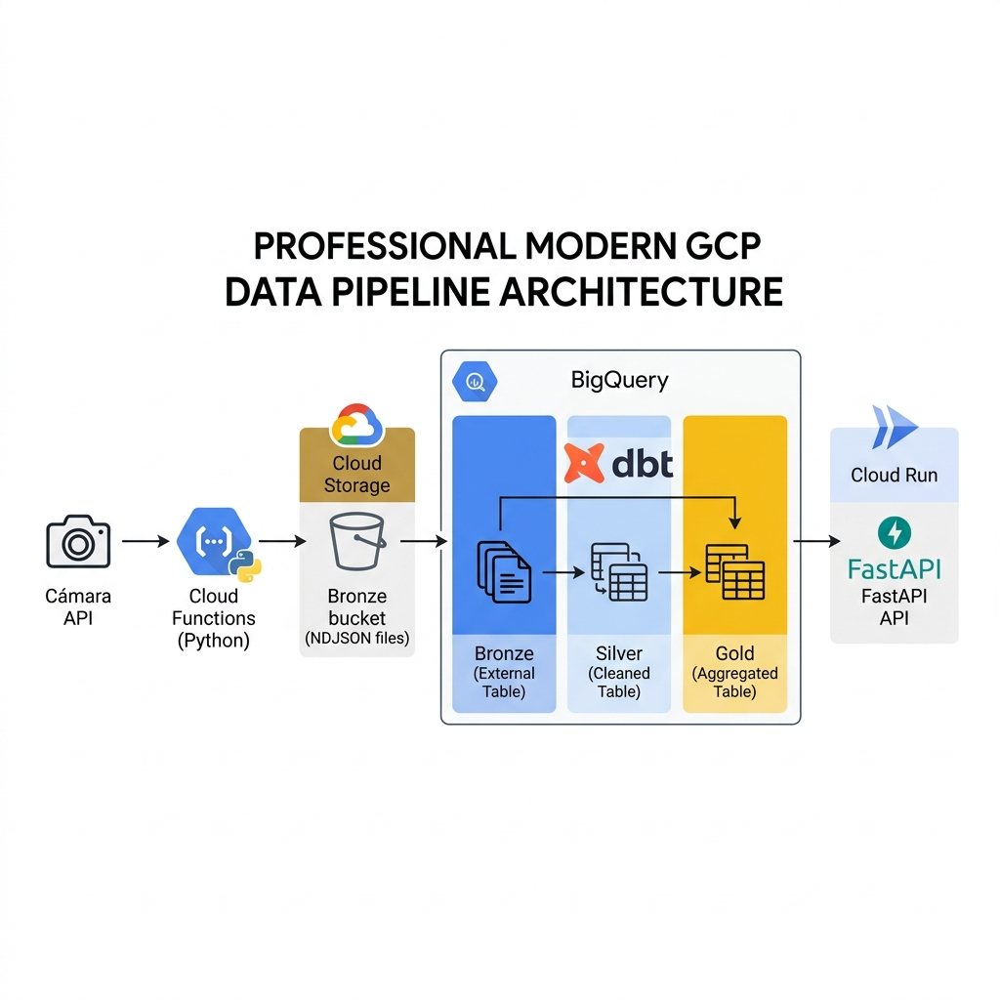

# Plataforma de Dados Medallion: Câmara Federal do Brasil 🇧🇷🏛️

Este documento é o guia técnico completo da solução de Data Warehouse construída para a análise de despesas da Câmara dos Deputados. Aqui detalhamos a arquitetura, os arquivos fonte e as decisões de engenharia.

---

## 🏗️ 1. Arquitetura e Fluxo de Dados
A solução utiliza a **Arquitetura Medallion** no Google Cloud Platform, garantindo rastreabilidade e qualidade dos dados desde a origem até a entrega.

---

## 🛠️ 2. Ingestão Serverless (Camada Bronze)
Os dados são extraídos da API oficial da Câmara e armazenados em formato bruto no Cloud Storage.

- **Arquivo Principal**: [`ingestion/main.py`](ingestion/main.py)
- **Lógica**: Scripts Python modulares que iteram sobre os deputados e buscam suas despesas mensais, convertendo-as para **NDJSON** (exigência do BigQuery).
- **Dependências**: [`ingestion/requirements.txt`](ingestion/requirements.txt)
- **Agendamento**: Orquestrado pelo **Cloud Scheduler**, disparando as Cloud Functions diariamente às 03:00 AM.

---

## ☁️ 3. Infraestrutura como Código (Terraform)
Toda a infraestrutura do GCP é provisionada e gerenciada via código, permitindo reprodutibilidade total.

- **Recursos Principais**: [`terraform/main.tf`](terraform/main.tf) (Buckets, Cloud Functions, Cloud Run, BigQuery Datasets).
- **Variáveis**: [`terraform/variables.tf`](terraform/variables.tf) (IDs de projeto, regiões e nomes de ambiente).
- **Estado**: [`terraform/backend.tf`](terraform/backend.tf) (Configuração do GCS para armazenar o estado do Terraform).

---

## 📊 4. Analytics e Transformação (dbt)
O **dbt (Data Build Tool)** atua como o motor de elite para transformar o dado bruto em inteligência de negócio, agora com nomes de colunas em **Inglês** e suporte a **CDC**.

### 📸 Captura de Mudanças (CDC via Snapshots)
- **Modelos**: [`dbt/snapshots/sn_deputados.sql`](dbt/snapshots/sn_deputados.sql) e [`sn_despesas.sql`](dbt/snapshots/sn_despesas.sql).
- **Objetivo**: Implementação de **SCD Type 2** para garantir que nenhuma alteração na API seja perdida. Cada mudança gera uma nova versão do registro com `dbt_valid_from` e `dbt_valid_to`.

### 🥉 Camada Bronze (Staging)
- **Foco**: Renomeação internacional (Eng), tipagem e geração de metadados de auditoria.
- **Auditoria**:
    - `processed_at`: Data da primeira inserção do registro (imutável).
    - `modified_at`: Data da última alteração de versão no snapshot.

### 🥈 Camada Silver (Truth Layer)
- **Foco**: Modelagem Dimensional (`dim_deputados`) e Fatos (`fct_despesas`).
- **Nomes**: Padronização global (ex: `gross_amount` em vez de `valor_bruto`).

### 🥇 Camada Gold (Business Layer)
- **Modelo**: [`dbt/models/gold/vw_looker_analytics.sql`](dbt/models/gold/vw_looker_analytics.sql).
- **Foco**: View pronta para o Looker Studio, unindo fatos e dimensões com aliases amigáveis.

---

## 🔐 Apêndice: Comandos Críticos de Manutenção
- **Rodar dbt localmente**: `dbt build --target dev`.
- **Habilitar APIs via Terminal**: `gcloud services enable ...` (ver detalhes no histórico de conversas).
- **Bootstrap da API**: No primeiro deploy, o Cloud Run usa a imagem `hello` para evitar erros de repositório vazio.

---
**Desenvolvido com foco em escalabilidade, segurança e excelência técnica.** 📉✨
